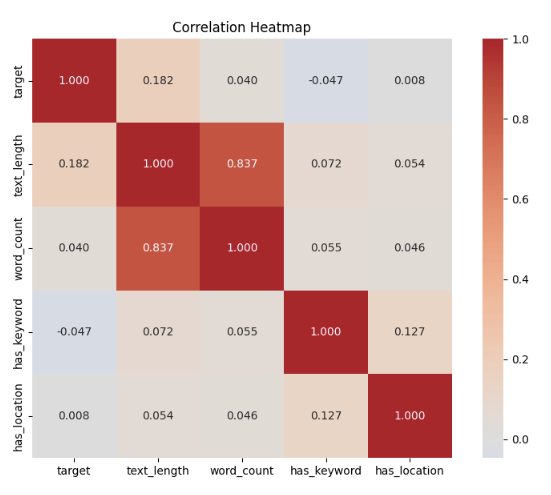
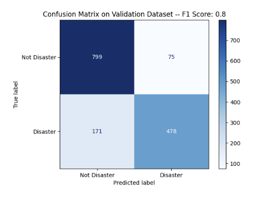

NLP (Natural Language Processing) Disaster Tweets¶
This Kaggle competition is about classifying texts. It is an excellent introduction to Natural Language Processing (NLP).

Original Competition and Data source: https://www.kaggle.com/c/nlp-getting-started/overview

Github: https://github.com/GHeart01/NLP-Disaster-Tweets

A screenshot of your position on the Kaggle competition leaderboard for your top-performing model.

Table of Contents
Description
EDA
Model Architecture
Results and Analysis
Hypertuning
Conclusion
Citation

Description
This Kaggle Competition focuses on Natural Language Processing (NLP) using Disaster Tweets. The challange here is predicting which tweets are about real disasters and which are not. Here we have a binary classification where 1 is real and 0 is not real.The goal in this competition is to automatically distinguish between tweets that describe actual disasters, and tweets that use words like "ABLAZE" in a metaphorical or humorous sense.

I will analyze the data using NLP and produce an output csv file to compare against the correct values to determine the strength of my NLP.

